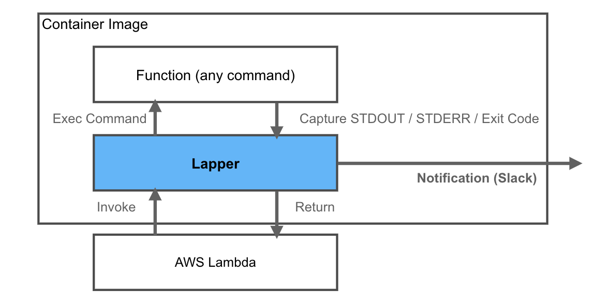

Lapper (Lambda wrapper)
=========


**! Lapper is still in Beta version !**  
Lapper is a wrapper container for Lambda Functions.



## Concept

* Easy to add notification on your function. 
* Function Language agnostic.

## Usage

### 1. Build Container Image


Build your container image from lapper container image. 

```
FROM docker.pkg.github.com/finatext/lapper/lapper:beta
WORKDIR ${LAMBDA_TASK_ROOT}
COPY test.sh ${LAMBDA_TASK_ROOT}
CMD ["./test.sh"]
```

### 2. Set Environment Variables

You can use these variables.

* `LAPPER_SLACK_WEBHOOK_URL`(Optional) ... Slack Webhook URL for notification.
* `LAPPER_NOTIFY_COND`(Optional, Default:stderr) ... Specify when to notify.
    * `all` ... Notify every time.
    * `stderr` ... Notify if stderr was output.
    * `exitcode` ... Notify if exit code wasn't 0.
* `LAPPER_POST_STDOUT`(Optional, Default:`false`) ... Whether includes STDOUT on message.
* `LAPPER_POST_STDERR`(Optional, Default:`true`) ... Whether includes STDERR on message.
* `LAPPER_POST_ERROR`(Optional, Default:`true`) ... Whether includes error on message.

## Examples

* [Go](./examples/go/)
* [Shell Script](./examples/shell/)

## License

[MIT](./LICENSE.md)

## Author

[Satoshi Tajima](https://github.com/s-tajima)
